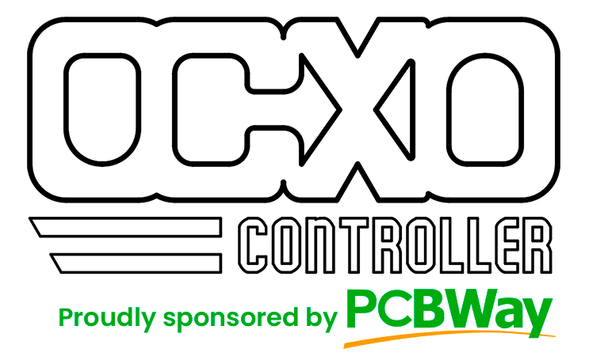
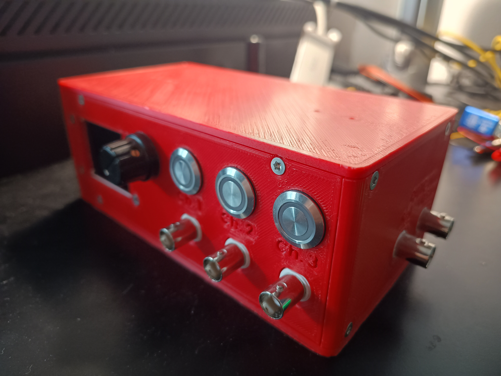
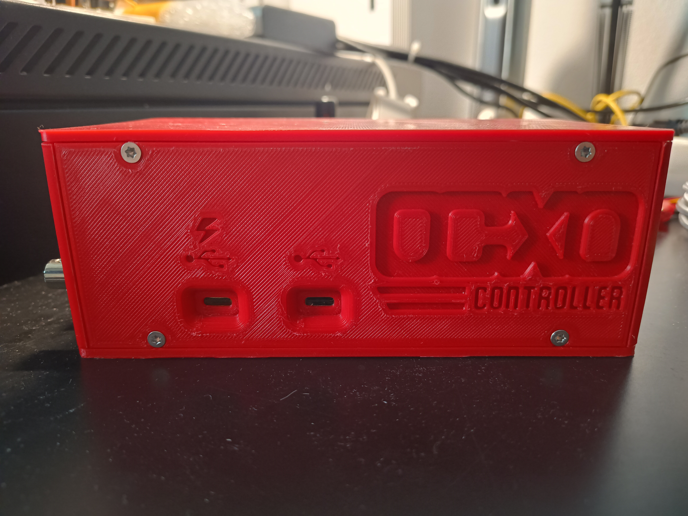
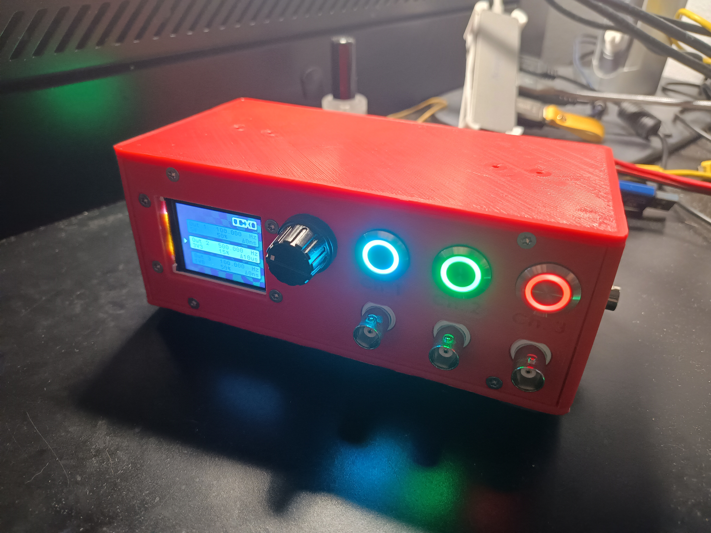
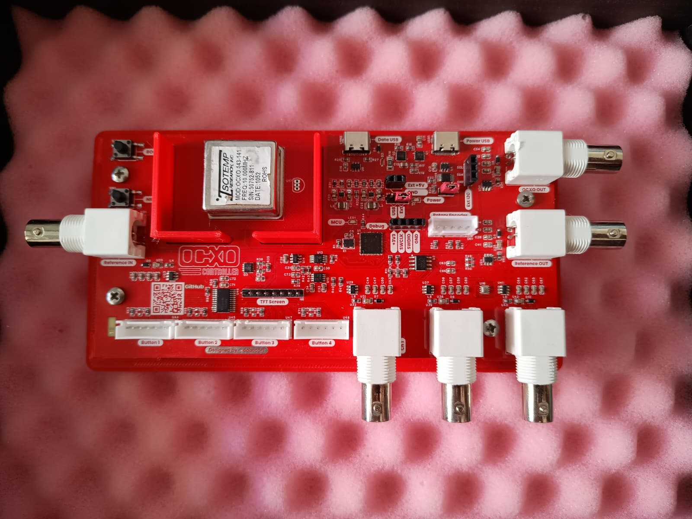
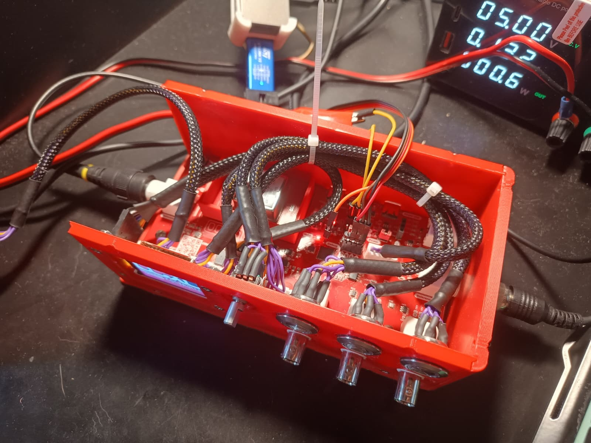

# OCXO Controller

By @dabecart, 2025.

✨ This project was sponsored by [**PCBWay**](#a-huge-thank-you-to-pcbway) ✨

Control the frequency of an OCXO (Oven Controlled Crystal Oscillator) to synchronize it with an external
signal of reference. Use it on a radio transmitter or for precision frequency measurement!

# Video

# Gallery

# A Huge Thank You to PCBWay! 

Whether you're a hobbyist, engineer, or student, I feel confident in saying that they're the go-to destination for high-quality PCB manufacturing and prototyping.

Here are just a few of the reasons why PCBWay stands out:

✅ Top-notch Quality: After thoroughly inspecting all of the PCBs of my project, I was content with the great precision the PCBs were made. I felt they are reliable and durable!

✅ Fast Turnaround: The whole ordering, manufacturing and shipping of the PCBs and the stencil to Spain took around a week and a half, which is most impressing! 

✅ Affordable Pricing: Their competitive rates make professional-grade PCBs accessible to everyone.

✅ Excellent Support: From order placement to final delivery, PCBWay’s team was always there to answer my questions and provide guidance.

Thanks to their expertise and dedication, I was able to turn my ideas for this project into reality without a hitch. If you’re working on your next PCB project, I can’t recommend PCBWay enough!

🎉 Visit [**PCBWay.com**](https://www.pcbway.com/) and experience their amazing service for yourself!

✨ And a final thanks to PCBWay for their patronage! ✨